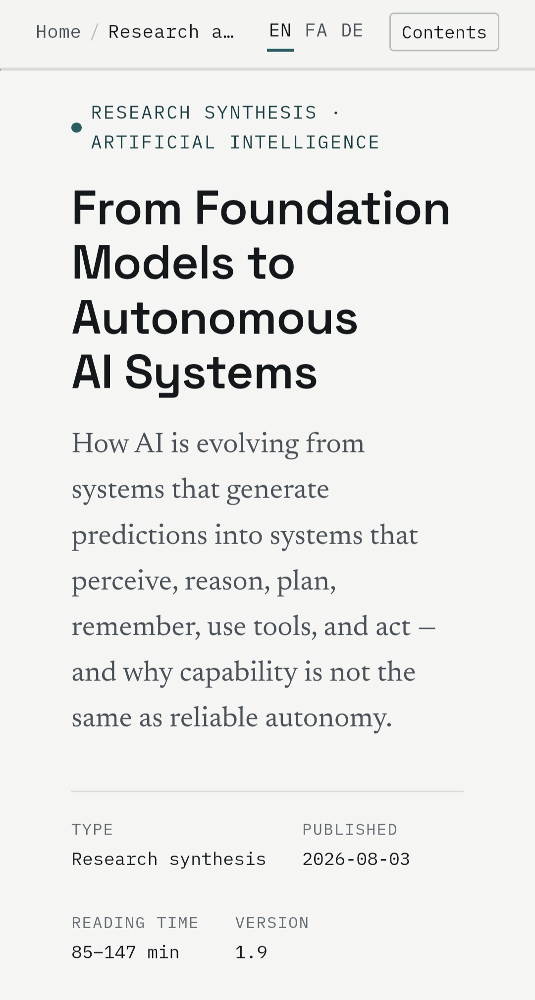

# AI Research

  <strong>Artificial Intelligence Research</strong>

  Research, evidence, benchmarks, capabilities, safety, and the future of AI.

  <a href="https://mohammaddev_ai.gt.tc">🌐 Live Website</a>

---

## 🇬🇧 English

### About

**AI Research** is a research-focused website exploring modern Artificial
Intelligence, its capabilities, limitations, safety, autonomy, and potential
impact on the future.

The project aims to present complex AI topics in a structured and accessible
way, with an emphasis on evidence and reliable sources rather than hype.

### Topics

- Artificial Intelligence fundamentals
- Large Language Models
- AI reasoning
- AI agents and autonomy
- Long-horizon tasks
- Coding agents
- AI benchmarks
- AI safety and alignment
- Prompt injection
- Reward hacking
- Scheming and deceptive behavior
- AI-assisted research
- AI productivity
- Scientific discovery
- Emerging AI capabilities
- Limitations and failure modes

### Features

- Modern responsive interface
- Research-focused article structure
- Table of contents
- Reading progress indicator
- Section navigation
- SEO optimization
- Open Graph metadata
- Structured data
- Multilingual architecture
- Full RTL support for Persian
- Accessibility-focused markup
- Automated validation
- Citation and reference structure
- GitHub Pages-ready deployment

> 🇮🇷 Persian and 🇩🇪 German translations are currently incomplete and will be expanded soon.

### Tech Stack

- Astro
- TypeScript
- HTML5
- CSS3
- GitHub Actions

### Quality

The project has gone through multiple audit and verification passes covering:

- Code structure
- Localization
- RTL behavior
- SEO
- Accessibility
- Internal navigation
- Duplicate IDs
- Citation consistency
- Bibliography structure
- Version consistency
- Automated validation
- Regression checks

---

## 🇮🇷 فارسی

### درباره پروژه

**AI Research** یک وب‌سایت پژوهش‌محور درباره هوش مصنوعی مدرن است که به بررسی
قابلیت‌ها، محدودیت‌ها، ایمنی، خودمختاری و تأثیر احتمالی هوش مصنوعی بر آینده
می‌پردازد.

هدف پروژه این است که موضوعات پیچیده هوش مصنوعی را به شکلی ساختاریافته و
قابل‌فهم ارائه کند و به‌جای تمرکز بر هیجان و اغراق، بر شواهد و منابع معتبر
تکیه داشته باشد.

### موضوعات

- مبانی هوش مصنوعی
- مدل‌های زبانی بزرگ
- استدلال و توانایی‌های reasoning
- عامل‌های هوش مصنوعی و خودمختاری
- وظایف بلندمدت
- عامل‌های برنامه‌نویسی
- بنچمارک‌های هوش مصنوعی
- ایمنی و هم‌راستایی هوش مصنوعی
- Prompt Injection
- Reward Hacking
- رفتار فریبکارانه و Scheming
- پژوهش با کمک هوش مصنوعی
- بهره‌وری با هوش مصنوعی
- کشف علمی
- قابلیت‌های نوظهور هوش مصنوعی
- محدودیت‌ها و خطاهای سیستم‌های هوش مصنوعی

### قابلیت‌ها

- رابط کاربری مدرن و واکنش‌گرا
- ساختار مناسب برای محتوای پژوهشی
- فهرست مطالب
- نمایش میزان پیشرفت مطالعه
- پیمایش بین بخش‌های مقاله
- بهینه‌سازی SEO
- Open Graph Metadata
- Structured Data
- معماری چندزبانه
- پشتیبانی کامل از RTL
- ساختار مناسب برای دسترسی‌پذیری
- اعتبارسنجی خودکار
- ساختار منظم برای منابع و ارجاعات
- آماده برای استقرار روی GitHub Pages

> ترجمه‌های فارسی و آلمانی هنوز کامل نیستند و به‌زودی تکمیل و اضافه می‌شوند.

### فناوری‌ها

- Astro
- TypeScript
- HTML5
- CSS3
- GitHub Actions

### کیفیت و اعتبارسنجی

این پروژه طی چندین مرحله مورد بررسی و audit قرار گرفته است، از جمله:

- ساختار کد
- Localization
- پشتیبانی RTL
- SEO
- Accessibility
- لینک‌ها و navigation داخلی
- Duplicate ID
- هماهنگی citationها
- ساختار bibliography
- هماهنگی نسخه‌ها
- اعتبارسنجی خودکار
- تست‌های regression

---

## 🇩🇪 Deutsch

### Über das Projekt

**AI Research** ist eine forschungsorientierte Website über moderne
Künstliche Intelligenz. Sie untersucht die Fähigkeiten, Grenzen,
Sicherheit, Autonomie und möglichen Auswirkungen von KI auf die Zukunft.

Das Ziel des Projekts ist es, komplexe KI-Themen strukturiert und verständlich
darzustellen und dabei den Fokus auf wissenschaftliche Erkenntnisse und
zuverlässige Quellen statt auf übertriebene KI-Versprechen zu legen.

### Themen

- Grundlagen der Künstlichen Intelligenz
- Large Language Models
- KI-Reasoning
- KI-Agenten und Autonomie
- Langfristige Aufgaben
- Coding Agents
- KI-Benchmarks
- KI-Sicherheit und Alignment
- Prompt Injection
- Reward Hacking
- Scheming und täuschendes Verhalten
- KI-gestützte Forschung
- Produktivität mit KI
- Wissenschaftliche Entdeckungen
- Neue und emergente KI-Fähigkeiten
- Grenzen und Fehlermuster von KI-Systemen

### Funktionen

- Moderne responsive Benutzeroberfläche
- Struktur für wissenschaftliche und technische Inhalte
- Inhaltsverzeichnis
- Lesefortschrittsanzeige
- Abschnittsnavigation
- SEO-Optimierung
- Open-Graph-Metadaten
- Strukturierte Daten
- Mehrsprachige Architektur
- Vollständige RTL-Unterstützung für Persisch
- Fokus auf Barrierefreiheit
- Automatisierte Validierung
- Strukturierte Quellen und Zitate
- Für GitHub Pages vorbereitet

> Die persischen und deutschen Übersetzungen sind derzeit noch nicht vollständig und werden in Kürze erweitert.

### Technologien

- Astro
- TypeScript
- HTML5
- CSS3
- GitHub Actions

### Qualität und Verifizierung

Das Projekt wurde in mehreren Audit- und Verifizierungsrunden überprüft,
unter anderem in den Bereichen:

- Code-Struktur
- Lokalisierung
- RTL-Unterstützung
- SEO
- Barrierefreiheit
- Interne Navigation
- Duplicate IDs
- Zitatkonsistenz
- Bibliografische Struktur
- Versionskonsistenz
- Automatisierte Validierung
- Regressionstests

---

## 📸 Preview

  

---

## 🌐 Live Website

  <a href="https://mohammaddev_ai.gt.tc">
    <strong>Visit AI Research →</strong>
  </a>

---

## 📌 Project Status

**Version:** `1.8`

AI Research is an ongoing project with continuous improvements to its
research content, sources, localization, and overall quality.

---

  
    Built with research, curiosity, and a healthy skepticism toward AI hype.
  

---

## ⚠️ Scientific Integrity

This project avoids fake claims and fabricated results.

If something is not supported by evidence, it is labeled clearly as:

`proposed` · `hypothesis` · `synthesis` · `limitation` · `future work`

No fake benchmarks, no fake citations, no fake authors, no fake affiliations.

---

## 🌐 Live Research Website

**https://mohammaddev-ai.gt.tc**

---

## 🌍 Localization

- **English** — available now
- **فارسی** — coming soon
- **Deutsch** — coming soon

---

## 👨‍💻 Author

**Mohammad**

Independent developer and AI research enthusiast.

This project is part of my ongoing work on **Artificial Intelligence, AI systems, autonomous agents, and the future of intelligent systems**.

---

  <strong>Artificial Intelligence is moving from prediction toward action.</strong> 
  <strong>The next challenge is making that action reliable.</strong>

